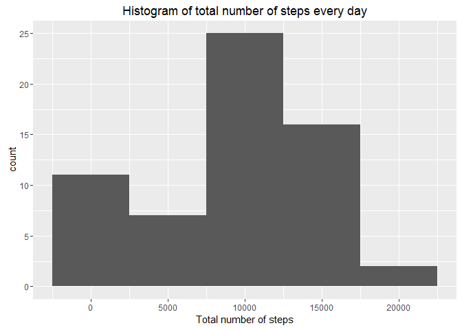
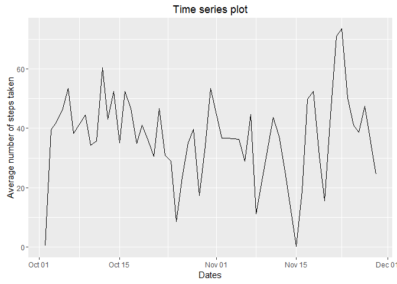
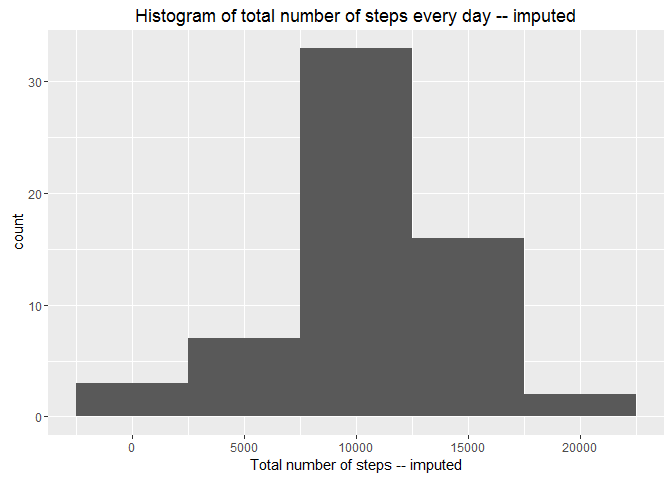
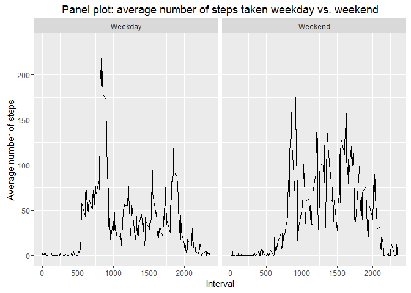

# Week 2 exercises knitr and markdown
Vinay Mahajan  
November 2, 2016  


### 1. Read the data file, set up the working directory and necessary libraries

```r
library(data.table)
library(ggplot2)
library(xtable)
```

```
## Warning: package 'xtable' was built under R version 3.3.2
```

```r
setwd ("C:\\Users\\VinayMahajan\\Desktop\\Misc\\Coursera Data Science\\week2knitr\\source\\")

# 1 Create activity data
activity <- fread("activity.csv", check.names = TRUE)

activity <- activity[, visdate := as.POSIXct( gsub("-", "/", date), format="%Y/%m/%d") ]
activity <- activity[, weekdayend := ifelse(  format(visdate, "%u") %in% c(6, 7), "Weekend", "Weekday" )]

# Count number of records per day
activity0 <- activity [, nrow := .N , by = date]
activity0 <- activity0 [, nonmiss := sum(is.na(steps)) , by = date]

# Remove records where the non missing records are equal to all records
activity01 <- activity0 [ nrow > nonmiss, ]

### All the analysis will be carried out with days on which there is
### at least 1 non missing value for steps.

# 2 Histogram of the total number of steps taken each day
# Create Total steps for every day

activity2 <- activity01 [, .(sum = sum(steps),
                           mean = mean(steps),
                           median = median(steps) ) , by = visdate]

# Create the histogram with missing values
activity2_hist <- activity [, .(sum = sum(steps)) , by = visdate]
activity2_hist[is.na(activity2_hist)] <- 0
```

### 2. Histogram for total number of steps every day

```r
ggplot(activity2_hist, aes(x=sum)) + geom_histogram(binwidth=5000) +
         labs(title="Histogram of total number of steps every day",
              x="Total number of steps")
```

<!-- -->

### 3. Mean and median number of days every day

```r
print (activity2, type="html")
```

```
##        visdate   sum       mean median
##  1: 2012-10-02   126  0.4375000      0
##  2: 2012-10-03 11352 39.4166667      0
##  3: 2012-10-04 12116 42.0694444      0
##  4: 2012-10-05 13294 46.1597222      0
##  5: 2012-10-06 15420 53.5416667      0
##  6: 2012-10-07 11015 38.2465278      0
##  7: 2012-10-09 12811 44.4826389      0
##  8: 2012-10-10  9900 34.3750000      0
##  9: 2012-10-11 10304 35.7777778      0
## 10: 2012-10-12 17382 60.3541667      0
## 11: 2012-10-13 12426 43.1458333      0
## 12: 2012-10-14 15098 52.4236111      0
## 13: 2012-10-15 10139 35.2048611      0
## 14: 2012-10-16 15084 52.3750000      0
## 15: 2012-10-17 13452 46.7083333      0
## 16: 2012-10-18 10056 34.9166667      0
## 17: 2012-10-19 11829 41.0729167      0
## 18: 2012-10-20 10395 36.0937500      0
## 19: 2012-10-21  8821 30.6284722      0
## 20: 2012-10-22 13460 46.7361111      0
## 21: 2012-10-23  8918 30.9652778      0
## 22: 2012-10-24  8355 29.0104167      0
## 23: 2012-10-25  2492  8.6527778      0
## 24: 2012-10-26  6778 23.5347222      0
## 25: 2012-10-27 10119 35.1354167      0
## 26: 2012-10-28 11458 39.7847222      0
## 27: 2012-10-29  5018 17.4236111      0
## 28: 2012-10-30  9819 34.0937500      0
## 29: 2012-10-31 15414 53.5208333      0
## 30: 2012-11-02 10600 36.8055556      0
## 31: 2012-11-03 10571 36.7048611      0
## 32: 2012-11-05 10439 36.2465278      0
## 33: 2012-11-06  8334 28.9375000      0
## 34: 2012-11-07 12883 44.7326389      0
## 35: 2012-11-08  3219 11.1770833      0
## 36: 2012-11-11 12608 43.7777778      0
## 37: 2012-11-12 10765 37.3784722      0
## 38: 2012-11-13  7336 25.4722222      0
## 39: 2012-11-15    41  0.1423611      0
## 40: 2012-11-16  5441 18.8923611      0
## 41: 2012-11-17 14339 49.7881944      0
## 42: 2012-11-18 15110 52.4652778      0
## 43: 2012-11-19  8841 30.6979167      0
## 44: 2012-11-20  4472 15.5277778      0
## 45: 2012-11-21 12787 44.3993056      0
## 46: 2012-11-22 20427 70.9270833      0
## 47: 2012-11-23 21194 73.5902778      0
## 48: 2012-11-24 14478 50.2708333      0
## 49: 2012-11-25 11834 41.0902778      0
## 50: 2012-11-26 11162 38.7569444      0
## 51: 2012-11-27 13646 47.3819444      0
## 52: 2012-11-28 10183 35.3576389      0
## 53: 2012-11-29  7047 24.4687500      0
##        visdate   sum       mean median
```

### 4. Time series plot of the average number of steps taken

```r
ggplot( data = activity2, aes( visdate, mean)) + geom_line() +
         labs(title="Time series plot",
              x = "Dates",
              y = "Average number of steps taken")
```

<!-- -->

### 5. The 5-minute interval that, on average, contains the maximum number of steps

```r
# The 5-minute interval that, on average, contains the maximum number of steps
activity3 <- activity01 [, .(mean = mean(steps)), by = interval]
activity3 <- activity3[order(-mean, interval)]
print (activity3, type="html")
```

```
##      interval     mean
##   1:      835 206.1698
##   2:      840 195.9245
##   3:      850 183.3962
##   4:      845 179.5660
##   5:      830 177.3019
##  ---                  
## 284:      350   0.0000
## 285:      355   0.0000
## 286:      415   0.0000
## 287:      500   0.0000
## 288:     2310   0.0000
```

### 6. Code to describe and show a strategy for imputing missing data

```r
# Code to describe and show a strategy for imputing missing data
# Impute based on the average value for each time interval

activity4 <- activity [, mean := mean(steps,na.rm = TRUE), by = interval]
activity4 <- activity4 [, steps2 := ifelse(is.na(steps), mean, steps), ]


activity4_imp <- activity4 [, .(sum_imp = sum(steps2),
                             mean_imp = mean(steps2),
                             median_imp = median(steps2) ) , by = visdate]
```

### 7. Histogram of the total number of steps taken each day after missing values are imputed

```r
# Histogram based on imputed data
ggplot(activity4_imp, aes(x=sum_imp)) + geom_histogram(binwidth=5000) +
         labs(title="Histogram of total number of steps every day -- imputed",
              x="Total number of steps -- imputed")
```

<!-- -->

### 8. Panel plot comparing the average number of steps taken per 5-minute interval across weekdays and weekends

```r
# Panel plot comparing the average number of steps taken per
# 5-minute interval across weekdays and weekends
activity5 <- activity01[ , .(Avg_5int_Weekdays = mean(steps)), by= .(interval, weekdayend )]

qplot(interval, Avg_5int_Weekdays, 
      data = activity5, geom="line", facets = . ~ weekdayend) +
    labs(title="Panel plot: average number of steps taken weekday vs. weekend",
         x = "Interval", 
         y = "Average number of steps")
```

<!-- -->
